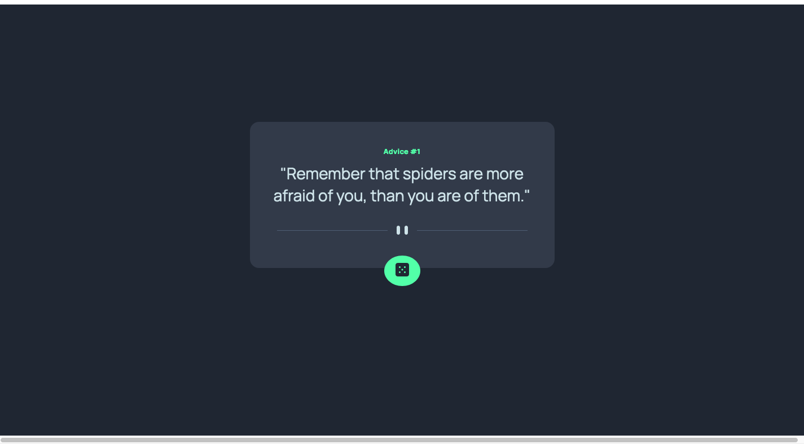

# Frontend Mentor - Advice generator app solution

This is a solution to the [Advice generator app challenge on Frontend Mentor](https://www.frontendmentor.io/challenges/advice-generator-app-QdUG-13db). Frontend Mentor challenges help you improve your coding skills by building realistic projects.

## Table of contents

- [Frontend Mentor - Advice generator app solution](#frontend-mentor---advice-generator-app-solution)
  - [Table of contents](#table-of-contents)
  - [Overview](#overview)
    - [The challenge](#the-challenge)
    - [Screenshot](#screenshot)
    - [Links](#links)
  - [My process](#my-process)
    - [Built with](#built-with)
    - [What I learned](#what-i-learned)
    - [Continued development](#continued-development)
    - [Useful resources](#useful-resources)
  - [Acknowledgments](#acknowledgments)


## Overview

### The challenge

Users should be able to:

- View the optimal layout for the app depending on their device's screen size
- See hover states for all interactive elements on the page
- Generate a new piece of advice by clicking the dice icon

### Screenshot




### Links

- Solution URL: [Solution URL](https://github.com/TorCanHack/advice-generator-app-main)
- Live Site URL: [live site URL](https://torcanhack.github.io/advice-generator-app-main/)

## My process

### Built with

- Semantic HTML5 markup
- CSS custom properties
- Flexbox
- Mobile-first workflow

### What I learned

This project enabled me to build upon my knowledge of the `fetch()` method in Javascript. I accessed the quotes from https://api.adviceslip.com/advice, a third-party API.


Initially, when I clicked the getadviceButton, I was not getting new quotes as my browser was caching the results and preventing the loading of new advice. To get around this limitation I set the catch-control header in the fetch request to no-cache as follows:
 ````js
 fetch('https://api.adviceslip.com/advice', { cache: 'no-cache' })
  .then(response => response.json())
  .then(data => {
     //...
});
 ````

### Continued development

I want to continue building and experimenting with the `fetch()` method in Javascript, particularly other requests than `GET` requests.

### Useful resources

- [How to Call an API in Javascript](https://www.freecodecamp.org/news/make-api-calls-in-javascript/) - This article dives deeply into the concept of API in Javascript  and it helped me to understand it better.


## Acknowledgments

Thank you to the Frontend Mentor team for this challenege.
